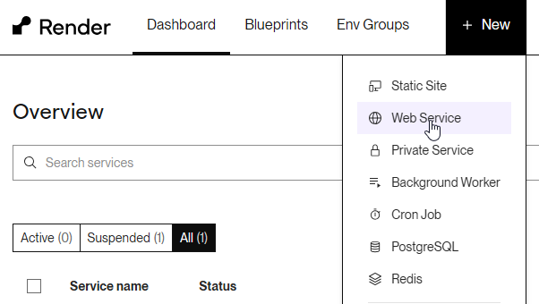
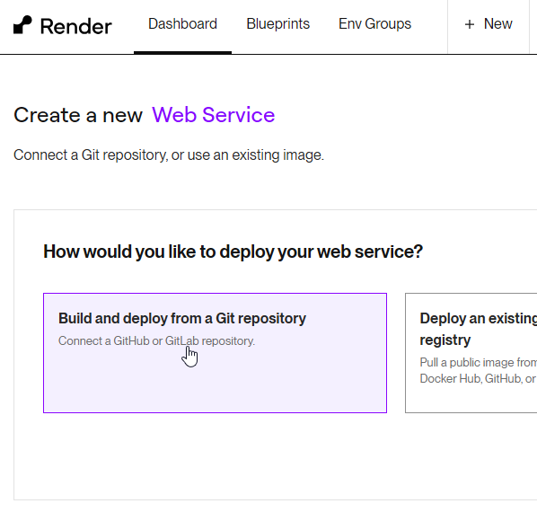
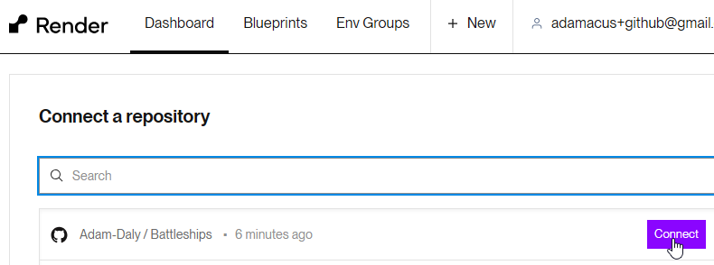
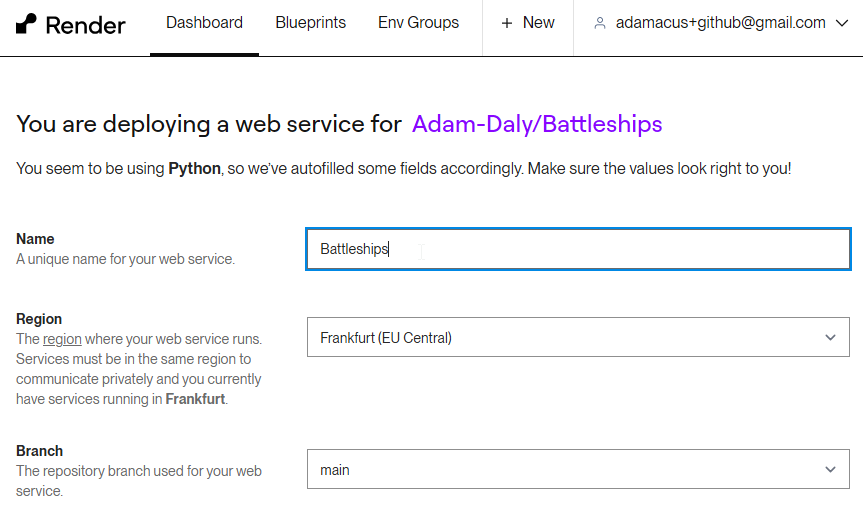

### Battleships

[Deployed Site](https://battleships-ou1c.onrender.com)

May take up to 1 minute to load if site has not been accessed recently.

## User Experience
The Battleships game provides a classic and engaging experience for users who want to enjoy a strategic board game. Upon starting the game, users are prompted to enter their name and decide whether they want to automate the placement of their ships or place them manually. The game features a turn-based system where the user and the computer take turns calling shots to hit each other's ships. The interface shows the player's board and the tracking board for the opponent's shots, ensuring an immersive experience. Victory is declared when one player sinks all of the opponent's ships.

## Target Audience
The target audience for Battleships includes strategy game enthusiasts, classic board game fans, and individuals looking for an interactive and engaging way to pass time. It is suitable for players of all ages who enjoy strategic thinking and planning.

## User Stories
- As a strategy game enthusiast, I want to manually place my ships to apply my own tactics and strategy.
- As a casual player, I want the option to automate ship placement for a quicker start.
- As a player, I want to see immediate feedback on my shots to know if I hit or missed.
- As a competitive player, I want to see the status of my ships and my opponent's board to plan my next moves.
- As a player, I want to be able to play multiple rounds to improve my strategy and try to beat the computer.

# Features

1. **Manual or Automated Ship Placement**: Players can choose to place their ships manually or let the computer place them randomly.

    

2. **Turn-Based Gameplay**: Players take turns calling shots to hit the opponent's ships, with real-time feedback on hits and misses.

    

3. **Real-Time Feedback**: Immediate visual feedback is given for hits ("X") and misses ("O") on both the player’s and opponent’s boards.

    

4. **Game Progress Tracking**: The game tracks the status of all ships and indicates when a ship is sunk.

    

5. **Game Rules Display**: Players can view the rules of the game at any time from the main menu to understand how to play and win.

    

## Future Feature Ideas
1. **Multiplayer Mode**: Allow two players to play against each other either locally or online.
2. **Enhanced AI**: Improve the computer's strategic thinking to provide a more challenging experience.
3. **Difficulty Levels**: Introduce varying levels of difficulty for different skill levels.
4. **Customizable Boards**: Allow players to customize the size of the board and the types of ships used in the game.

# Technology Used

1. Python
2. GitHub
3. Visual Studio Code

# Languages Used

1. Python

# Deployment Guide

Follow these steps to deploy your web service on Render.

1. **Sign up for Render**
   
   

2. **Create a new web service**
   
   

3. **Click "Build and Deploy from a GitHub repository"**
   
   

4. **Connect your repository, adding permissions if required**
   
   

5. **Choose your project name, region, and branch**
   
   

6. **Add build command "yarn"**
   
   

7. **Add start command "node index.js"**
   
   

8. **Select your instance type, "Free" in this case**
   
   

9. **Add environment variable "PORT" with value "8000"**
   
   

10. **Click "Create Web Service"**
    
    

# **User Story Testing**

| User Story                                                                                         | Expected Result                                                                                                                                                      | Pass    |
|----------------------------------------------------------------------------------------------------|----------------------------------------------------------------------------------------------------------------------------------------------------------------------|---------|
| As a strategy game enthusiast, I want to manually place my ships to apply my own tactics and strategy. | The player can manually place their ships on the board before the game starts.                                                                                       | &check; |
| As a casual player, I want the option to automate ship placement for a quicker start.                | The player can choose to automate the placement of their ships, allowing for a quicker game start.                                                                   | &check; |
| As a player, I want to see immediate feedback on my shots to know if I hit or missed.                | After each shot, the game immediately displays whether the shot was a hit or a miss.                                                                                 | &check; |
| As a competitive player, I want to see the status of my ships and my opponent's board to plan my next moves. | The game displays the player's board and a tracking board showing the status of shots fired at the opponent's ships.                                                 | &check; |
| As a player, I want to be able to play multiple rounds to improve my strategy and try to beat the computer. | The game allows the player to start new rounds and continue playing against the computer, improving their strategy with each round.                                   | &check; |

# **Manual Testing**

| Action                                                                                  | Input / Steps                                                                                       | Expected Result                                                                                                                                               | Pass    |
|-----------------------------------------------------------------------------------------|-----------------------------------------------------------------------------------------------------|---------------------------------------------------------------------------------------------------------------------------------------------------------------|---------|
| Start the game                                                                          | Run the program and enter a player name.                                                            | The game starts, welcoming the player and displaying options for ship placement.                                                                              | &check; |
| Choose automated ship placement                                                         | Enter "y" when prompted for automated ship placement.                                               | Ships are automatically placed on the player's board and the board is displayed.                                                                               | &check; |
| Choose manual ship placement                                                            | Enter "n" when prompted for automated ship placement.                                               | Player is prompted to manually place each ship by entering positions.                                                                                          | &check; |
| Manually place a ship correctly                                                         | Enter a valid position and orientation, e.g., "A1H" for a horizontal placement at A1.               | The ship is placed on the board at the specified position, and the board is updated accordingly.                                                              | &check; |
| Manually place a ship incorrectly                                                       | Enter an invalid position or orientation, e.g., "A11H" or "A1Z".                                    | An error message is displayed, and the player is prompted to enter a valid position and orientation again.                                                     | &check; |
| Take a turn to shoot at the opponent's board                                            | Enter a valid shot position, e.g., "E5".                                                            | The shot is registered, and immediate feedback is given (hit/miss). The tracking board is updated.                                                             | &check; |
| Enter an invalid shot position                                                          | Enter an invalid position, e.g., "K5" or "A0".                                                      | An error message is displayed, and the player is prompted to enter a valid shot position again.                                                                | &check; |
| View the game board                                                                     | N/A                                                                                                 | The player's board and the opponent's tracking board are displayed, showing the current game state.                                                            | &check; |
| Computer takes a turn                                                                   | Wait for the computer to take its turn after the player.                                            | The computer selects a valid shot position on the player's board, and the board is updated with the result of the computer's shot.                             | &check; |
| Check for winner                                                                        | N/A                                                                                                 | The game checks if all ships of either player or opponent are sunk and declares the winner if so.                                                              | &check; |
| Play multiple rounds                                                                    | Continue playing after a round is completed.                                                        | The game allows the player to start a new round and continue playing, improving their strategy with each round.                                                | &check; |
| View game rules                                                                         | Choose the option to see the rules from the main menu.                                              | The rules of the game are displayed, explaining how to play and win the game.                                                                                  | &check; |
| Restart the game                                                                        | Choose to restart after finishing a game.                                                           | The game resets, allowing the player to start a new game with ship placement options.                                                                          | &check; |
| Enter invalid option in main menu                                                       | Enter an invalid option when prompted in the main menu.                                             | An error message is displayed, and the player is prompted to enter a valid option.                                                                             | &check; |
| Observe real-time feedback for hits and misses                                          | Take turns shooting and observe the feedback for each shot.                                         | Immediate visual feedback is provided for each shot, showing hits ("X") and misses ("O") on the tracking board.                                                | &check; |
| Manually place all ships in the correct positions without overlap or out-of-bound errors | Enter valid positions and orientations for all ships, ensuring no overlaps or out-of-bound errors. | All ships are placed correctly on the board, and the game proceeds without any placement errors.                                                              | &check; |

# PEP8

No major issues found with PEP8 / pycodestyle.

# **Bugs**

| Issue                                                                                     | Description                                                                                           | Fix                                                                                                  | Pass    |
|-------------------------------------------------------------------------------------------|-------------------------------------------------------------------------------------------------------|------------------------------------------------------------------------------------------------------|---------|
| Index out of range due to board size                                                      | The game encountered an "index out of range" error when accessing board positions outside the valid range. | Adjust the board size initialization and ensure all ship placements and shots are within valid indices. | &check; |
| Column and row swapped                                                                    | The game swapped the column and row values during ship placement and shot validation.                  | Correct the logic to properly differentiate and use row and column values in the appropriate contexts. | &check; |
| Bracketing around tuples to properly return them                                          | The game had issues with incorrect tuple returns due to missing or incorrect bracketing.               | Ensure all tuples are correctly formatted with proper bracketing in return statements.               | &check; |
| Ships overlapping or placed out of bounds                                                 | Ships could be placed overlapping each other or out of the board boundaries.                           | Implement checks in the `validate_ship_position` method to prevent overlapping and out-of-bounds placements. | &check; |
| Input validation not handling lowercase or mixed case letters correctly                   | The game did not correctly handle lowercase or mixed case letters for coordinates input.               | Normalize input to uppercase before validation.                                                       | &check; |
| Computer turn logic could select already targeted positions                               | The computer's turn logic could choose positions that were already hit or missed.                      | Implement logic to track and avoid previously targeted positions.                                     | &check; |
| Manual ship placement not providing clear error messages for invalid inputs               | Players were not given clear error messages when entering invalid positions during manual placement.   | Enhance input validation and provide clear feedback for invalid inputs.                               | &check; |
| Game not ending when all ships of one player are sunk                                     | The game did not correctly end when all ships of either the player or opponent were sunk.              | Implement a check in `check_winner` method to correctly determine when the game should end.           | &check; |

